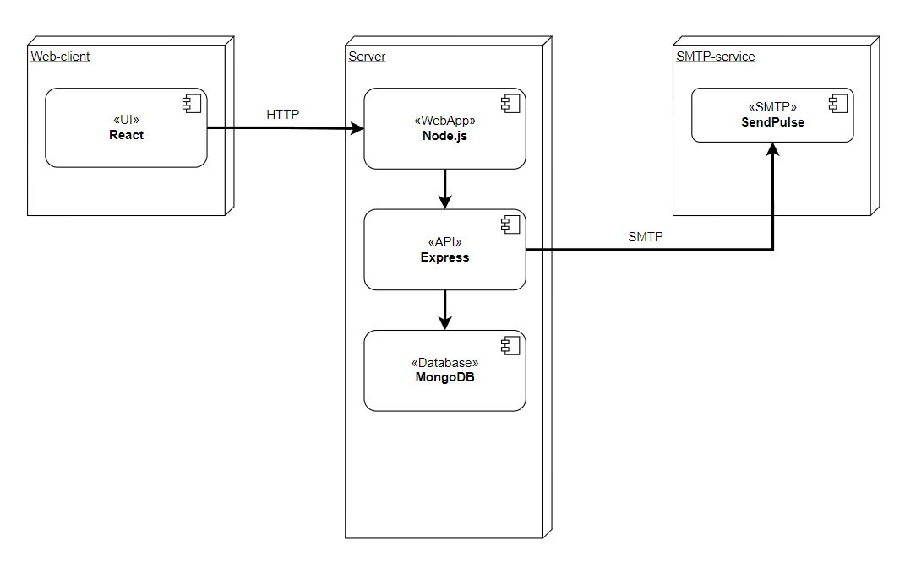

# Deployment

## Deployment diagram

### Software

De software wordt geïnstalleerd door Node.js. Via de command prompt worden er command uitgevoerd, die de afhankelijkheden van een project installeren. Eenmaal klaar is het enige wat nodig is het project uit te voeren. In development wordt dit lokaal gedaan, maar in productie wordt dit uiteraard op de productieserver gedaan.

### Database

De database bevat alle (gevoelige) data. In development heeft het team een database lokaal staan, maar in productie is er een online database waarbij beveiliging hoog in het vaandel staat.

### Mailer

De SMTP Service SendPulse wordt gebruikt voor het versturen/ontvangen van e-mails.

<!--
Intent

This section is used to describe the mapping between the software (e.g. containers) and the infrastructure. Sometimes this will be a simple one-to-one mapping (e.g. deploy a web application to a single web server) and at other times it will be more complex (e.g. deploy a web application across a number of servers in a server farm). This section answers the following types of questions:

• How and where is the software installed and configured?
• Is it clear how the software will be deployed across the infrastructure elements described in the infrastructure architecture section? (e.g. one-to-one mapping, multiple containers per server, etc)
• If this is still to be decided, what are the options and have they been documented?
• Is it understood how memory and CPU will be partitioned between the processes running on a single piece of infrastructure?
• Are any containers and/or components running in an active-active, active-passive, hot-standby, cold-standby, etc formation?
• Has the deployment and rollback strategy been defined?
• What happens in the event of a software or infrastructure failure?
• Is it clear how data is replicated across sites?
-->
