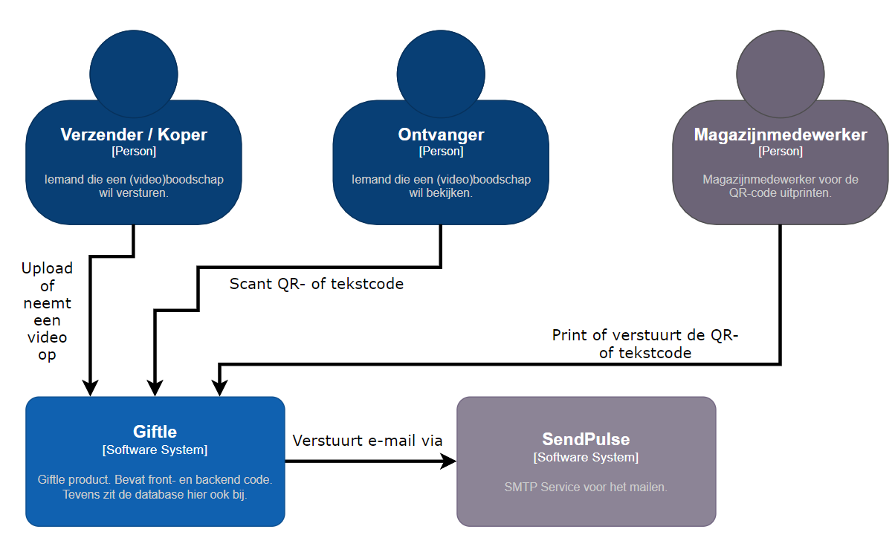
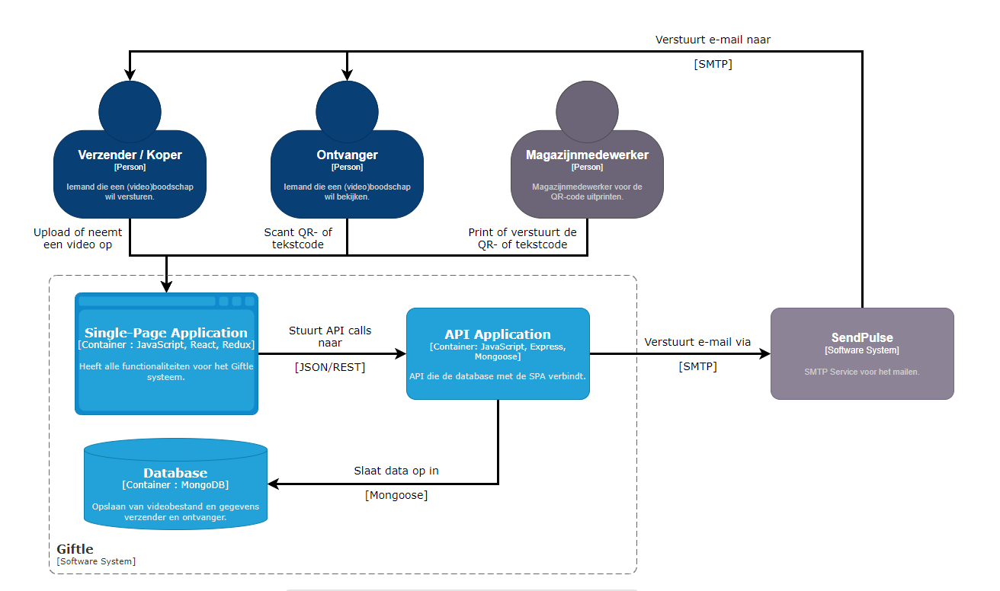
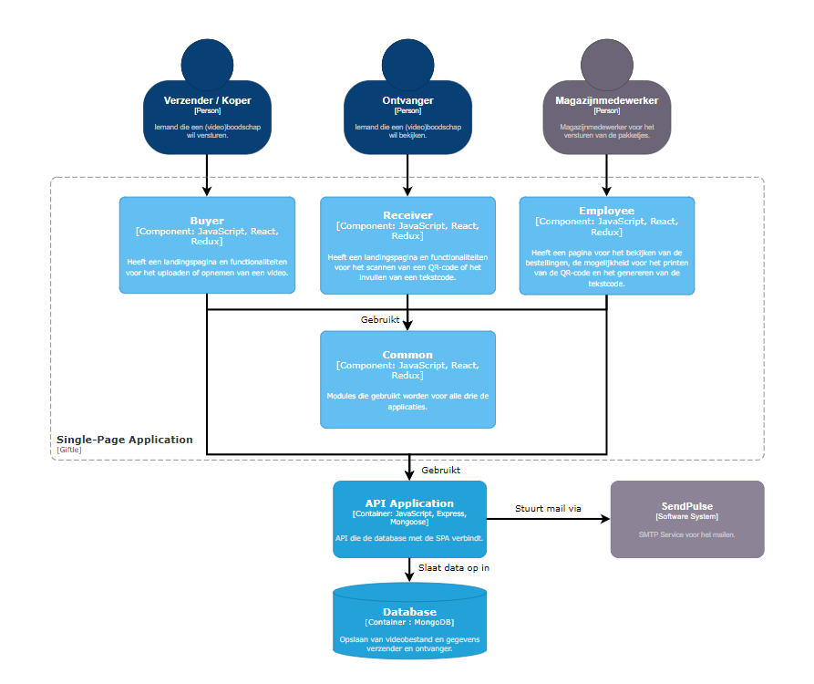

# Software Architecture

Er is een duidelijke structuur binnen de software architectuur. Zoals de afbeelding(en) hieronder weergeven, is duidelijk te zien wat er gebeurt en hoe dit allemaal samenhangt met elkaar.

## Level 1: System Context diagram

## Level 2: Container diagram

## Level 3: Component diagram

## Level 4: Code diagram

Niet van _toepassing / niet relevante informatie_ op dit _moment / niveau_. Zie hoofdstuk 8 Code

<!--
Intent

The purpose of this section is to summarise the software architecture of your software system so that the following questions can be answered:

• What does the “big picture” look like?
• Is there are clear structure?
• Is it clear how the system works from the “30,000 foot view”?
• Does it show the major containers and technology choices?
• Does it show the major components and their interactions?
• What are the key internal interfaces? (e.g. a web service between your web and business tiers)
-->
