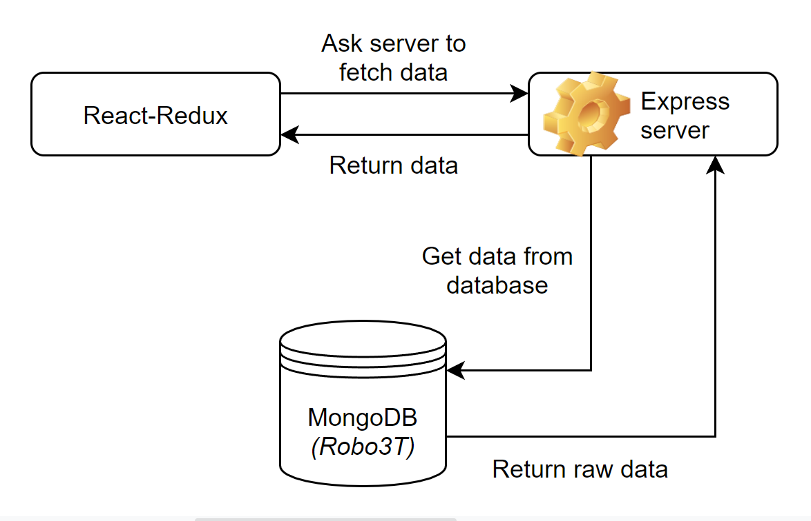

# Data

## Algemene informatie

*Datamodel*

De data wordt opgeslagen in MongoDB onder de databasenaam 'Giftle' en heeft op het moment maar één collectie (table), genaamd 'uploadschemas'. De data is bij het opleveren in bezit van de opdrachtgevers van dit project Giftle. Tijdens de productie is het team Koeskoes van de Hogeschool van Arnhem en Nijmegen (HAN) verantwoordelijk voor de data. Er is minimaal 50GB aan opslagruimte nodig voor alle data in deze database. Voor de productie is dit sowieso voldoende, maar als het project opgeleverd wordt, kan er meer opslagruimte nodig zijn.

De archieven van Giftle worden bewaard in het (GitHub) project van team Koeskoes. Zo kan het development team makkelijk en snel bij de documenten.

Binnen dit project zal het huidige development team geen gebruikmaken van "Flat files", ookwel platte databases (datamodellen voor databases).

## Wettelijke vereisten

Er zijn wettelijke vereisten voor de langetermijnarchivering van bedrijfsgegevens waar rekening mee gehouden moet worden. Deze zijn hier te vinden: [autoriteitpersoonsgegevens](https://www.autoriteitpersoonsgegevens.nl/nl/over-privacy/persoonsgegevens/bewaren-van-persoonsgegevens). Bovendien zijn er wettelijke vereisten voor log bestanden en "audit trails", die via de volgende twee bronnen te vinden zijn: [logbestanden](https://cip-overheid.nl/media/1169/bid-operationale-producten-bir-015-logging-beleid-10.pdf) & [audit trails](https://www.graydon.nl/nl/resources/blog/strategie/wat-een-audit-trail).

<!--
Intent

The purpose of the data section is to record anything that is important from a data perspective, answering the following types of questions:

• What does the data model look like?
• Where is data stored?
• Who owns the data?
• How much storage space is needed for the data? (e.g. especially if you’re dealing with “big data”)
• What are the archiving and back-up strategies?
• Are there any regulatory requirements for the long term archival of business data?
• Likewise for log files and audit trails?
• Are flat files being used for storage? If so, what format is being used?
-->
