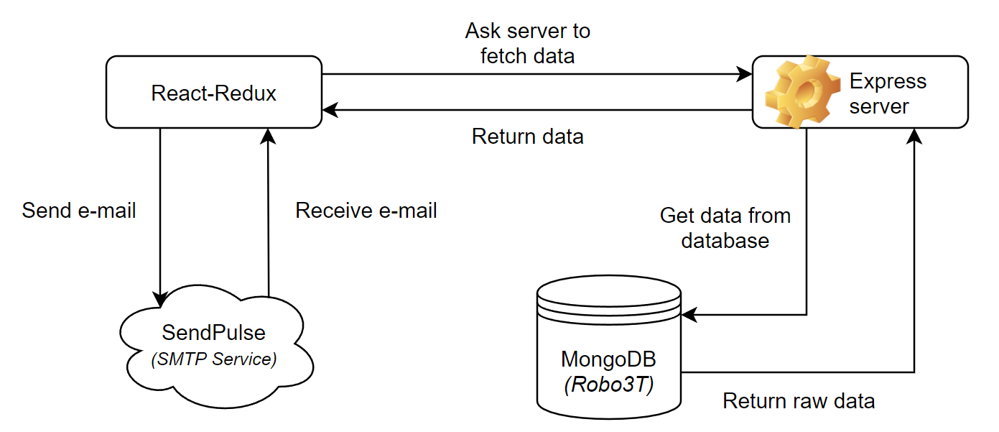

# Data

## Hoe ziet het datamodel eruit?

## Waar wordt de data opgeslagen?

De data wordt opgeslagen in MongoDB onder de databasenaam 'Giftle' en heeft op het moment maar 1 collectie (table) genaamd 'uploadschemas'.

## Wie heeft de data in bezit?

De data is bij het opleveren in bezit van de opdrachtgevers van dit project Giftle. Tijdens de productie is het team Koeskoes van de Hogeschool van Arnhem en Nijmegen (HAN) verantwoordelijk voor de data.

## Hoeveel opslagruimte is nodig voor de data?

Er is minimaal 50GB aan opslagruimte nodig. Voor de productie is dit goed, maar als het project opgeleverd wordt, dan kan er meer opslagruimte verwacht worden.

## Wat zijn de archieven en back-up strategieën?

De archieven worden bewaard in het (GitHub) project van team Koeskoes. Zo kan het development team makkelijk en snel bij de documenten.

## Zijn er wettelijke vereisten voor de langetermijnarchivering van bedrijfsgegevens?

Deze wettelijke vereisten zijn er zeker. Via de link kunt u de wettelijke vereisten voor de langetermijnarchivering van bedrijfsgegevens vinden: [autoriteitpersoonsgegevens](https://www.autoriteitpersoonsgegevens.nl/nl/over-privacy/persoonsgegevens/bewaren-van-persoonsgegevens)

## Zijn er wettelijke vereisten voor log bestanden en "audit trails"?

Deze wettelijke vereisten zijn er ook en kunt u via de volgende linkjes bekijken.

[logbestanden](https://cip-overheid.nl/media/1169/bid-operationale-producten-bir-015-logging-beleid-10.pdf)

[audit trails](https://www.graydon.nl/nl/resources/blog/strategie/wat-een-audit-trail)

## Worden "flat files" gebruikt voor opslag? Zo ja, welk formaat wordt er gebruikt?

"Flat files" zijn platte databases. Een platte database is een datamodel voor een database. Deze "flat files" worden niet door de huidige development team gebruikt.

<!--
Intent

The purpose of the data section is to record anything that is important from a data perspective, answering the following types of questions:

• What does the data model look like?
• Where is data stored?
• Who owns the data?
• How much storage space is needed for the data? (e.g. especially if you’re dealing with “big data”)
• What are the archiving and back-up strategies?
• Are there any regulatory requirements for the long term archival of business data?
• Likewise for log files and audit trails?
• Are flat files being used for storage? If so, what format is being used?
-->
