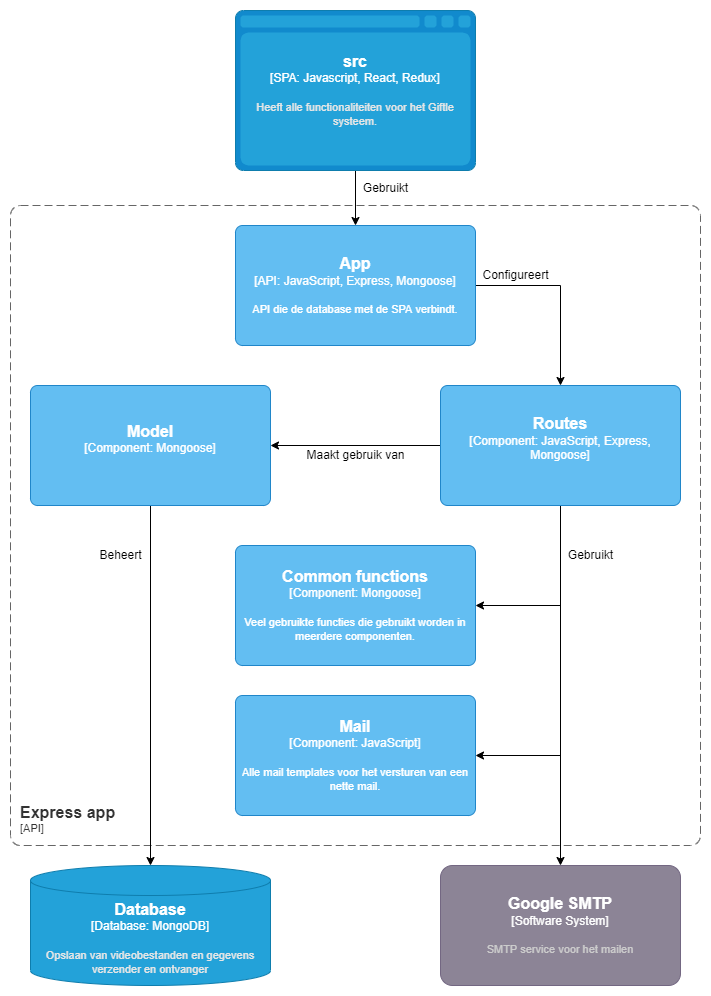

# Software Architecture

Er is een duidelijke structuur binnen de software architectuur. Zoals de afbeeldingen hieronder weergeven, is er duidelijk te zien wat er gebeurt en hoe dit allemaal met elkaar samenhangt.

## Level 1: System Context diagram

Zie [Context](01_context.md)

## Level 2: Container diagram

In onderstaand diagram is te zien hoe de verschillende gebruikers gebruik maken van de applicatie (src) en hoe deze src vervolgens communiceert met de rest van Giftle.

## Level 3: Component diagram

### Client application

In onderstaand diagram wordt de map 'src' uitgelicht. Deze is opgebouwd uit vijf onderdelen/mappen. Een map voor elke soort gebruiker ('Buyer', 'Receiver', 'Employee'), waarin alle bestanden staan die ieder een zichtbare pagina bevatten. Ten vierde de map 'Common', waarin componenten worden opgeslagen die gebruikt worden door alle soorten gebruikers (dus binnen de drie eerder besproken mappen). Ten slotte de map 'Redux', waarin de globale state wordt bijgehouden en dus ook de reducers en actions van de hele applicatie worden opgeslagen.

De eerste vier mappen ('Buyer', 'Receiver', 'Employee' en 'Common') zijn te vinden binnen de map 'components'. Redux heeft een aparte map binnen de src.

### Server application

In het diagram hieronder wordt de map 'Express' uitgelicht. De 'src' stuurt REST requests naar de 'App', waarin de connectie tussen de database en de applicatie wordt gelegd. Via de 'Routes' wordt er vervolgens daadwerkelijk gecommuniceerd met zowel de database als de SMTP server. In de map 'Common functions' staan functies die door meerdere routes gebruikt worden. In de map 'Mail' staan templates die gebruikt worden voor het versturen van de mails. In de map 'Model' staan de Mongoose schemas die gebruikt worden voor de database.

## Level 4: Code diagram

Niet van _toepassing / niet relevante informatie_ op dit _moment / niveau_. Zie [hoofdstuk 8 Code](08_code.md)
