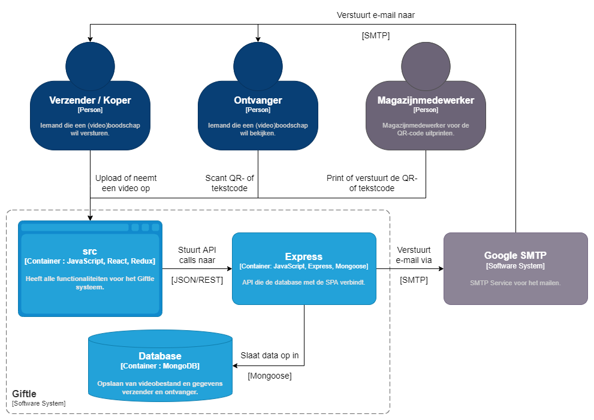
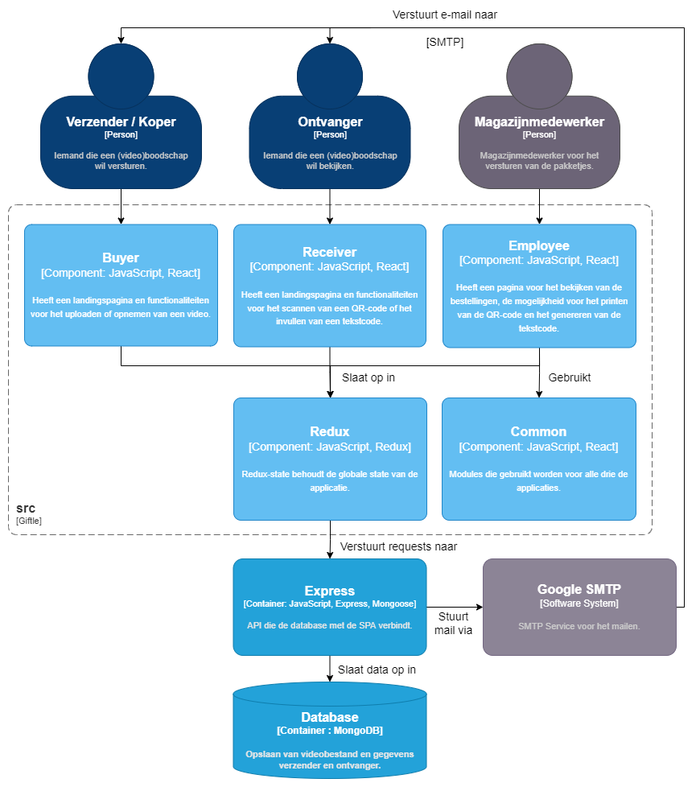

# Software Architecture

Er is een duidelijke structuur binnen de software architectuur. Zoals de afbeeldingen hieronder weergeven, is er duidelijk te zien wat er gebeurt en hoe dit allemaal met elkaar samenhangt.

## Level 1: System Context diagram

Zie [Context](01_context.md)

## Level 2: Container diagram

## Level 3: Component diagram

### Client application

### Server application

## Level 4: Code diagram

Niet van _toepassing / niet relevante informatie_ op dit _moment / niveau_. Zie [hoofdstuk 8 Code](08_code.md)
