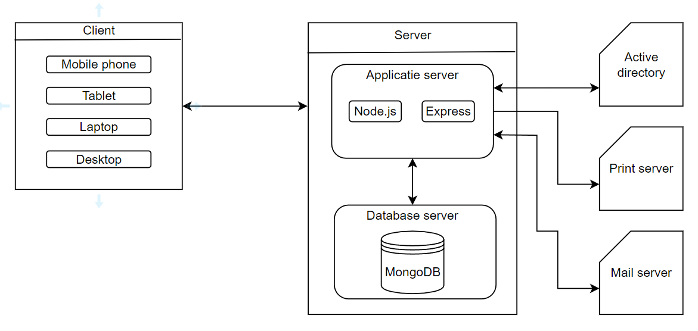

# Infrastructure Architecture
Aangezien de infrastructure architecture erg klein is, wordt hier verder in dit hoofdstuk niet op ingegaan. De informatie over infrastructure architecture kan gevonden worden in [hoofdstuk 11 deployment](11_deployment.md).

<!-- 
De fysieke architectuur is in de afbeelding hieronder te zien:

Om de kwaliteit van het product goed te bewaren, hebben wij zo min mogelijk redundante data en code, die wij willen gebruiken. Dit is te zien in de MongoDB database onder de collecties en documenten. Dit is tevens te zien in de code.

De verantwoordelijkheid van het onderhouden en ondersteunen voor de infrastructuur ligt bij team Koeskoes en de komende teams die aan dit project gaan verder werken. De eigenaar van de middelen is de opdrachtgever van Giftle.

Het development team heeft genoeg omgevingen voor de development en het testen. Voor de development is er zowel een lokale als een online omgeving (productieserver etc.). Voor het testen wordt er gebruikgemaakt van een JavaScript test framework genaamd '[Jest](https://jestjs.io/)'.

-->

<!--
Intent

This section is used to describe the physical/virtual hardware and networks on which the software will be deployed. Although, as a software architect, you may not be involved in designing the infrastructure, you do need to understand that it’s sufficient to enable you to satisfy your goals. The purpose of this section is to answer the following types of questions:

• Is there a clear physical architecture?
• What hardware (virtual or physical) does this include across all tiers?
• Does it cater for redundancy, failover and disaster recovery if applicable?
• Is it clear how the chosen hardware components have been sized and selected?
• If multiple servers and sites are used, what are the network links between them?
• Who is responsible for support and maintenance of the infrastructure?
• Are there central teams to look after common infrastructure (e.g. databases, message buses, application servers, networks, routers, switches, load balancers, reverse proxies, internet connections, etc)?
• Who owns the resources?
• Are there sufficient environments for development, testing, acceptance, pre-production, production, etc?
-->
