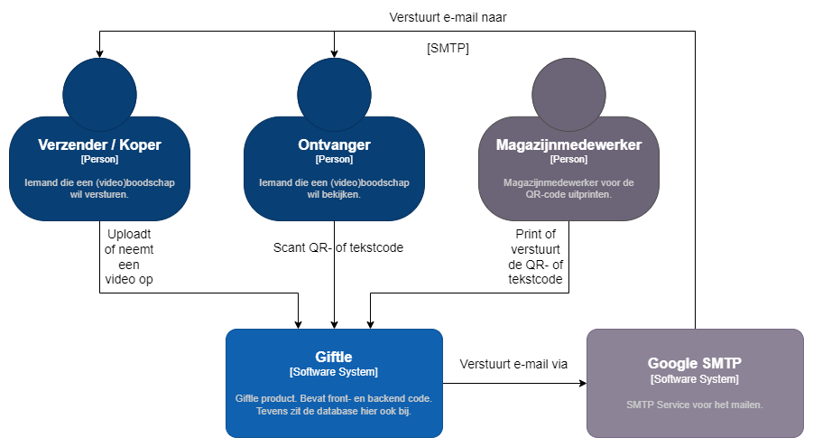

# Context

## Giftle

In het kort is het project Giftle een product, waarbij iemand een videoboodschap kan versturen als cadeau. Dit product wordt gezien als een plug-in, die uiteindelijk door meerdere webshops gebruikt kan worden.

De geüploade video's kunnen door de magazijnmedewerkers beheerd worden via een backend systeem. Hier kunnen ze met het versturen van een cadeau de QR-code uitprinten en aan het bijbehorende cadeau vastmaken.

Een video kan opgenomen worden in de browser of, wanneer de koper al een video heeft opgenomen, geüpload worden vanaf de computer naar de website. Wanneer het cadeau bij de ontvanger terecht komt, zal er een kaartje aan het cadeau hangen met een QR-code. Deze code zal verwijzen naar een webpagina waar de ontvanger de video van de koper kan bekijken.

Giftle zal dus door allerlei personen gebruikt worden die online aankopen doen. Jonge kinderen zullen dus buiten de doelgroep vallen, maar voor de rest is er geen specifieke leeftijdsgroep die Giftle niet zal gebruiken.

## To do
Het systeem is gemaakt zodat het makkelijk aan een webshopsysteem, zoals Magento of Shopify, gekoppeld kan worden. Wanneer iemand een cadeau bij een webshop koopt, krijgt de koper de mogelijkheid om als cadeauoptie een videoboodschap bij te bestellen en deze aan het cadeau te koppelen. 

Wanneer de ontvanger het cadeau heeft ontvangen en de videoboodschap heeft bekeken, kan de ontvanger hier een reactie op geven met een andere videoboodschap of een stukje tekst.
