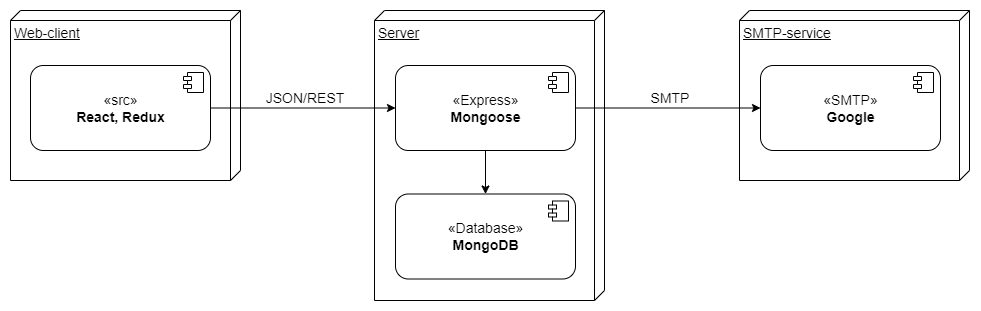

# Deployment

## Diagram
Hieronder in het system context diagram is te zien hoe alle interne en externe delen van de applicatie met elkaar in verhouding staan en waaruit deze zijn opgebouwd. Hieronder wat extra informatie over de server:

- CPU: 1 vCPU
- RAM: 1GB
- Opslag: 25GB
- OS: Ubuntu 18.04 x64
- Locatie: Amsterdam

*Deployment diagram*

## Software

De software wordt geïnstalleerd door [Node.js](https://nodejs.org/en/). Via de command prompt worden er commands (npm install) uitgevoerd, die de afhankelijkheden van het project installeren. Zodra dit gedaan is, is het enige wat nog nodig is het uitvoeren van het project. In development wordt dit lokaal gedaan, maar in productie wordt dit uiteraard op de productieserver gedaan.

## Database

De database bevat alle (gevoelige) data. In development heeft het team een database lokaal staan, maar in productie is er een online database waarbij beveiliging hoog in het vaandel staat.

## Mailer

De SMTP Service van Google wordt gebruikt voor het versturen/ontvangen van e-mails.

# Deployment op de server
Op de volgende manier "deployen" wij ons project naar de server:

1. Navigeer naar de 0.Giftle map (standaard locatie: C:\Users\{naam}\Documents\GitHub\sep2021-project-koeskoes\koeskoes\0.Giftle).
2. Typ het volgende in bij de command prompt of windows powershell: "npm run build".
3. Een map build wordt aangemaakt, deze map moet in de Express map verplaatst worden.
4. Verander alle "localhost:4000" in de code naar "www.giftle.nl". Het makkelijkst om dit te doen is: find all -> replace all
5. **!!NOTE!!** app.js en App.test.js moet localhost:3000 blijven! \
*Verander voor de rest* alle "localhost:3000" in de code naar "giftle.nl".
6. Verander in app.js de PORT "4000" naar "80"
7. Gebruik een FTP software (wij gebruiken filezilla)
   |          |              |
   |----------|--------------|
   | host     | 178.62.234.7 |
   | username | root         |
   | password | vragen aan team Koeskoes |
   | port     | 22           |
8. Ga naar: \
            "/var/www" map \
            nodemodules niet meenemen (i.v.m. tijd) en verplaats de gehele Express map in de "/www/giftle" map \
            gebruik putty -> server inloggen -> root + password (vragen aan team Koeskoes): \
            --> npm i (om alle afhankelijkheden weer te installeren) \
            --> sudo reboot (opnieuw opstarten van de server)

<!--
Intent

This section is used to describe the mapping between the software (e.g. containers) and the infrastructure. Sometimes this will be a simple one-to-one mapping (e.g. deploy a web application to a single web server) and at other times it will be more complex (e.g. deploy a web application across a number of servers in a server farm). This section answers the following types of questions:

• How and where is the software installed and configured?
• Is it clear how the software will be deployed across the infrastructure elements described in the infrastructure architecture section? (e.g. one-to-one mapping, multiple containers per server, etc)
• If this is still to be decided, what are the options and have they been documented?
• Is it understood how memory and CPU will be partitioned between the processes running on a single piece of infrastructure?
• Are any containers and/or components running in an active-active, active-passive, hot-standby, cold-standby, etc formation?
• Has the deployment and rollback strategy been defined?
• What happens in the event of a software or infrastructure failure?
• Is it clear how data is replicated across sites?
-->
