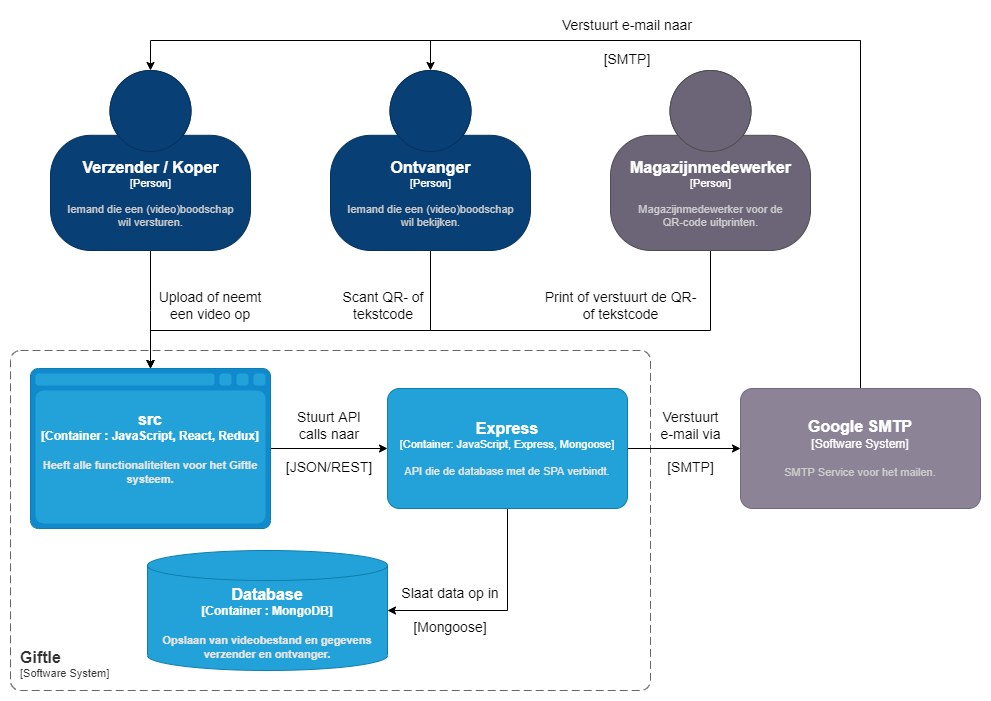
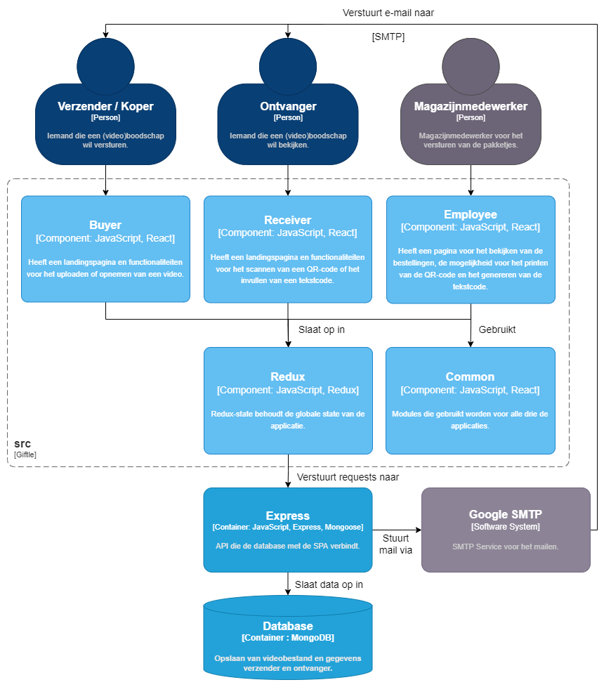
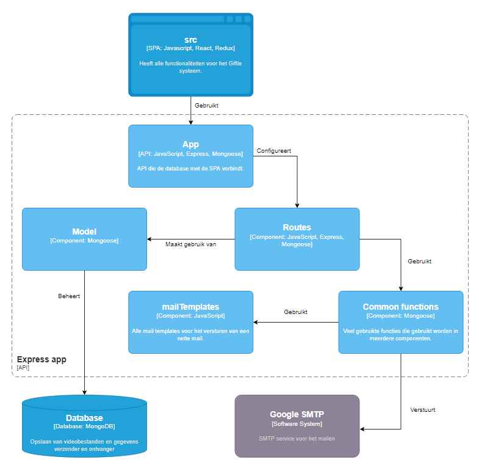

# Software Architecture

Er is een duidelijke structuur binnen de software architectuur. Zoals de afbeeldingen hieronder weergeven, is er duidelijk te zien wat er gebeurt en hoe dit allemaal met elkaar samenhangt.

## Level 1: System Context diagram

Zie [Context](01_context.md)

## Level 2: Container diagram

In de diagram hieronder is te zien met welk element van Giftle de drie verschillende gebruikers interactie hebben, en hoe deze src vervolgens communiceert met de rest van Giftle. 

## Level 3: Component diagram

### Client application

In de diagram hieronder wordt de map 'src' uitgelicht. Deze is opgebouwd uit vijf onderdelen/mappen. Een map voor elke soort gebruiker (verzender, ontvanger en magazijnmedewerker), waarin alle bestanden staan die ieder een zichtbare pagina bevatten. Ten vierde de map Common, waarin functies worden opgeslagen die gebruikt worden door alle soorten gebruikers (dus binnen de drie eerder genoemde mappen). Ten slotte de map Redux, waarin de globale state wordt bijgehouden en dus ook de reducers en actions van de hele applicatie worden opgeslagen.

De eerste vier mappen (Buyer, Receiver, Employee en Common) zijn te vinden binnen 'components'. Redux heeft een aparte map binnen de src.

### Server application

In de diagram hieronder wordt de map 'Express' uitgelicht. De 'src' maakt gebruik van het bestand App.js, waarin de connectie tussen de database en de applicatie wordt gelegd. Via de Routes wordt er vervolgens daadwerkelijk gecommuniceerd met zowel de database als de SMTP server.

## Level 4: Code diagram

Niet van _toepassing / niet relevante informatie_ op dit _moment / niveau_. Zie [hoofdstuk 8 Code](08_code.md)
